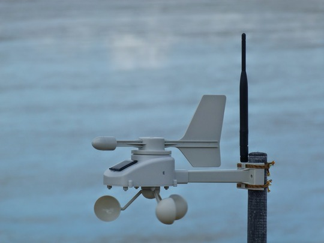

pioupiou-v0
===========

Fichiers sources pour la balise Pioupiou version 0

Les fichiers de CAO (schéma et PCB) sont à utiliser avec le logiciel Kicad, gratuit (et Grenoblois !). Disponible pour Windows, Mac et Linux sur http://www.kicad-pcb.org/

Ce « brouillon » a été mis à la retraite après avoir rempli sa mission. Nous pouvons maintenant nous appuyer sur cette expérience pour mettre au point Pioupiou version 1. https://open.pioupiou.fr/Pioupiou_v1

## BUGS :
Il y a deux bugs à corriger sur cette version :
* Il faut enlever le plan de masse sous les connecteurs des batteries, sinon risque de court-circuit.
* Il faut ajouter une TVS ainsi qu'une self de 10nH en parallèle entre l'antenne et la masse. (protection électricité statique des orages)

## License

Copyright (c) 2015 Bac Plus Zéro SAS

Copyright (c) 2016 Altostratus SA

Copyright (c) 2021 OpenWindMap SCIC SA and contributors

**Permission is granted to anyone to use this Material for any purpose, including commercial applications, and to alter it and redistribute it freely, subject to the following restrictions:**

**ATTRIBUTION:** You must give appropriate credit, provide a link to the license, and indicate if changes were made. You may do so in any reasonable manner, but not in any way that suggests the licensor endorses you or your use.

**SHARE-ALIKE:** If you remix, transform, or build upon the Material, you must distribute your contributions under the same license as the original. You must include a copy of this License with every copy of this Material or modified version of this Material You distribute or otherwise make available.

**OBLIGATION TO SHARE WITHIN THE OPENWINDMAP NETWORK:** If you use this Material or a modified version of this Material to build a product that collects environmental data, this data must be published within the OpenWindMap network. You must not intentionally degrade the quality of the data, reduce the accuracy of its geolocation or delay its dissemination.

**OPEN-DATA:** If you use this Material or a modified version of this Material to build a product that collects environmental data, this data should be published under an Open-Data license. The chosen license must allow free reuse and redistribution, including from commercial entities and for commercial use. The choosen license must either be compliant with the [Open Definition](https://opendefinition.org/od/2.1/en/) or receive approval from OpenWindMap's board. You are allowed to offer a version of this data under any other license of your choice (including non-free licenses), as long as you also provide an identical version of this data under an Open-Data license as defined in this paragraph.

**DISCLAIMER OF WARRANTY/LIMITATION OF REMEDIES:** OpenWindMap and its contributors have no obligation to support this Material. OpenWindMap and its contributors are providing this Material "AS IS", with no express or implied warranties of any kind, including, but not limited to, any implied warranties of merchantability or fitness for any particular purpose or warranties against infringement of any proprietary rights of a third party.

**OpenWindMap and its contributors will not be liable for any consequential, incidental, or special damages, or any other relief, or for any claim by any third party, arising from your use of this Material.**

For the avoidance of doubt, OpenWindMap may offer this Material under separate terms or conditions or stop distributing this Material at any time; however, doing so will not terminate this License.
